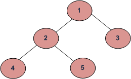

# Problemas de F#
### Pregunta 1

### Los programas pueden correrse en el compilador online: https://onecompiler.com/fsharp/

## 1.b.i  Tipo de dato Church
Este problema se encuentra en el archivo church.fs. El tipo de dato Church se creó con el discriminated union de F#. Este tipo de dato puede ser utilizado en las funciones suma y multiplicación, que aceptan dos numerales de Church de tipo Church como entrada. 

La función suma opera de manera recursiva y va añadiendo un nuevo Suc de tipo Church dependiendo de los valores proporcionados a la función. Por otro lado, la función multiplicación opera igualmente de manera recursiva con ayuda de la función suma y se utiliza la definición de multiplicación como un conjunto de sumas.

Para correr este programa se debe modificar el código en la función main e incluir los números que forman los numerales de Church para obtener su suma o multiplicación. Como existe una función llamada churchOf no es necesario escribir manualmente el número de Church, solo se debe colocar el número natural que lo representa. 
Algunos ejemplos de llamadas en main son:

    let main = multiplicacion (churchOf 2)(churchOf 2) |> printf "%A"

O:

    let main = suma (churchOf 4)(churchOf 6) |> printf "%A"

## 1.b.i Max Heap Simétrico 
Este problema se encuentra en el archivo arbol.fs. Se creó el tipo de dato Arbol con un discriminated union que no solo es recursivo, sino que también cuenta con una entrada de valores de un tipo genérico. Para conseguir si el árbol es max heap simétrico o no, utilizamos el hecho de que un árbol es max heap simétrico, si y solo si los recorridos preorder y postorder son iguales.

Sabiendo esto, se crearon funciones recursivas para visitar el árbol tanto para preorder y postorder y obtener así una lista con los órdenes de los nodos. Finalmente, se verifica si estas listas son iguales.

Para correr el programa se debe modificar el código, únicamente en la definición de la variable arbolito en donde se define el árbol que se desea evaluar. El tipo árbol puede ser una Rama de tipo x con dos hijos o una Hoja de tipo x. Por esto, al definir la variable se debe considerar Rama a aquellos nodos que tienen hijos y Hoja a aquellos nodos sin hijos. Un ejemplo de la creación de un árbol es:

        let arbolito = Rama (1, Rama (2, Hoja(4),Hoja(5)), Hoja(3))

##### Nota: No se debe eliminar "|> printf "%A"" debido a que esto permite la impresión en pantalla del resultado de la operación o la función llamada en main.

